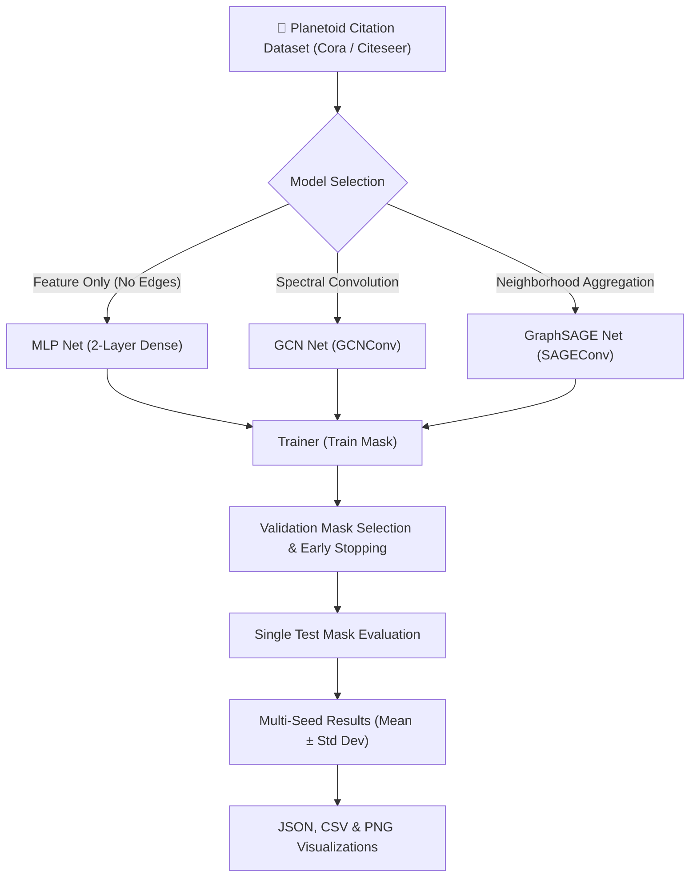

# Graph Neural Networks (GNN) Citation Network Classification & Benchmarking

[](https://github.com/shivangisrivastava013/GNN-Citation-Network-Classification/actions/workflows/ci.yml)
[](https://pytorch.org/)
[](https://pytorch-geometric.readthedocs.io/)
[](LICENSE)

Modular PyTorch Geometric framework for evaluating **Multi-Layer Perceptron (MLP)**, **Graph Convolutional Networks (GCN)**, and **GraphSAGE** on academic citation networks (**Cora** and **Citeseer**). Includes multi-seed statistical validation, early-stopping validation selection, and explicit synthetic graph fallback.

---

## 📐 System Architecture



---

## 🌟 Key Features & Dataset Specifications

1. **Multi-Model Benchmark Suite**:
   - **MLP Baseline**: 2-layer feature classifier ignoring graph edges to isolate structural message-passing gains.
   - **GCN**: Spectral graph convolution utilizing normalized adjacency matrices:
     $$H^{(l+1)} = \sigma \left( \tilde{D}^{-\frac{1}{2}} \tilde{A} \tilde{D}^{-\frac{1}{2}} H^{(l)} W^{(l)} \right)$$
   - **GraphSAGE**: Inductive feature aggregation over localized node neighborhoods.

2. **Official Planetoid Dataset Specifications**:
   - Evaluated on official PyTorch Geometric `Planetoid` dataset splits:
   
   | Dataset | Nodes | Edges | Features | Classes | Train Count | Val Count | Test Count | Graph Type | Features Normalization |
   | :--- | :---: | :---: | :---: | :---: | :---: | :---: | :---: | :---: | :---: |
   | **Cora** | 2,708 | 10,556 | 1,433 | 7 | 140 | 500 | 1,000 | Undirected | Row-Normalized |
   | **Citeseer** | 3,327 | 9,104 | 3,703 | 6 | 120 | 500 | 1,000 | Undirected | Row-Normalized |

3. **Rigorous Evaluation & Latency Methodology**:
   - Models trained exclusively on `train_mask` with early stopping based on `val_mask` loss/accuracy.
   - Test set (`test_mask`) evaluated **strictly once** using the restored best validation checkpoint.
   - Statistical evaluation across 5 random seeds (`42, 123, 456, 789, 2026`) reporting Mean ± Standard Deviation.
   - **Latency Methodology**: Inference latency was measured on CPU after 5 warm-up passes and averaged across 100 forward passes per seed run. Environment metadata is saved to [`results/environment_metadata.json`](file:///C:/Users/SHIVANGI/.gemini/antigravity/scratch/GNN-Citation-Network-Classification/results/environment_metadata.json).

4. **Explicit Synthetic Mode**:
   - Includes `--synthetic` flag for reproducible CI and offline testing without silent fallback masking.

---

## 📊 Empirical Benchmark Results (5-Seed Average)

Generated automatically by running `python demo.py`:

| Dataset | Model Architecture | Test Accuracy (Mean ± Std) | Macro F1 (Mean ± Std) | Weighted F1 | Inference Latency (ms) |
| :--- | :--- | :---: | :---: | :---: | :---: |
| **Cora** | **MLP (Baseline)** | 0.5576 ± 0.0096 | 0.5472 ± 0.0044 | 0.5604 | 3.11 ms |
| **Cora** | **GCN** | **0.8072 ± 0.0093** | **0.8007 ± 0.0089** | **0.8082** | 9.79 ms |
| **Cora** | **GraphSAGE** | 0.7942 ± 0.0047 | 0.7876 ± 0.0063 | 0.7953 | 23.16 ms |
| **Citeseer** | **MLP (Baseline)** | 0.5352 ± 0.0127 | 0.5127 ± 0.0142 | 0.5402 | 10.93 ms |
| **Citeseer** | **GCN** | 0.6820 ± 0.0124 | 0.6457 ± 0.0106 | 0.6827 | 18.05 ms |
| **Citeseer** | **GraphSAGE** | **0.6830 ± 0.0051** | **0.6474 ± 0.0045** | **0.6865** | 53.68 ms |

---

## 🚀 Quickstart & Reproducible Commands

### 1. Installation
```bash
git clone https://github.com/shivangisrivastava013/GNN-Citation-Network-Classification.git
cd GNN-Citation-Network-Classification

pip install -r requirements.txt
```

### 2. Run Full Multi-Seed Benchmark
```bash
# Run benchmark across Cora & Citeseer over 5 seeds
python demo.py

# Run benchmark in explicit synthetic mode (offline / CI)
python demo.py --synthetic
```

### 3. Single Model Training & Evaluation
```bash
# Train GraphSAGE on Cora
python scripts/train.py --dataset Cora --model graphsage --epochs 200

# Evaluate saved checkpoint
python scripts/evaluate.py --dataset Cora --model graphsage --checkpoint results/weights/best_model.pth
```

### 4. Run PyTest Suite
```bash
python -m pytest tests/ -v
```

---

## 🐳 Docker Deployment

```bash
# Build Docker Image
docker build -t gnn-citation-classification:latest .

# Run Containerized Benchmark
docker run --rm gnn-citation-classification:latest
```

---

## 🛠️ Repository Structure

```text
GNN-Citation-Network-Classification/
├── configs/                  # YAML dataset & training hyperparameter configs
│   ├── cora.yaml
│   ├── citeseer.yaml
│   └── pubmed.yaml
├── demo.py                   # Main benchmark entrypoint script
├── Dockerfile                # Container deployment specification
├── gnn_model/                # Core Package
│   ├── __init__.py
│   ├── datasets.py           # Planetoid dataset loader & SyntheticCitationGraph
│   ├── models.py             # MLPNet, GCNNet, GraphSAGENet definitions
│   ├── trainer.py            # GNNTrainer with validation early-stopping
│   ├── evaluator.py          # GNNEvaluator (Loss, Accuracy, F1, Latency)
│   ├── experiment.py         # Multi-seed BenchmarkRunner engine
│   └── utils.py              # Matplotlib/Seaborn visualization utilities
├── pyproject.toml            # Project quality & build metadata
├── requirements.txt          # Python dependencies
├── results/                  # Generated benchmark logs & visualization plots
│   ├── benchmark_results.json
│   ├── benchmark_summary.csv
│   ├── accuracy_comparison.png
│   ├── f1_comparison.png
│   └── training_curves.png
└── tests/                    # Pytest test suite
    ├── test_datasets.py
    ├── test_models.py
    ├── test_reproducibility.py
    └── test_trainer_evaluator.py
```

---

## 📜 License

Distributed under the [MIT License](LICENSE).
